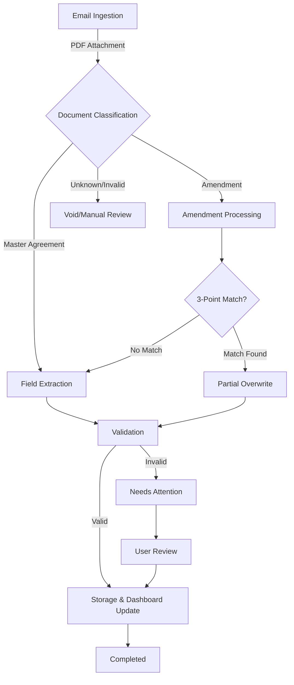

# End-to-End Workflow: Stripe Contract Extraction

## 1. Process Overview
**Objective:** To automatically ingest, classify, and extract structured commercial contract data from Stripe agreements (Master Agreements and Amendments) delivered via email.
**Value:** Ensures accuracy in commercial terms, operational efficiency, compliance, and continuity of contract records.

## 2. Workflow Diagram

## 3. Detailed Process Steps

### Step 1: Ingestion & Filtering
*   **Trigger:** Email received with PDF attachment.
*   **Action:**
    *   Filter for PDF files only.
    *   Ignore non-contract files (images, inline text).
    *   Check for duplicates based on filename and metadata.
*   **Output:** Queue of valid PDF documents.

### Step 2: Document Parsing & Classification
*   **Action:** Parse PDF text and analyze headers/titles.
*   **Logic:**
    *   **Master Agreement:** Standard contract structure.
    *   **Amendment:** Contains keywords like "Amendment", "Amends Agreement titled...".
*   **Output:** Classification as `Master Agreement` or `Amendment`.

### Step 3: Field Extraction (Master Agreements)
*   **Action:** Extract all required fields using AI models.
*   **Scope:** Metadata, Commercials, Territories, Incentives, Legal Terms, Subscription Details.
*   **Reference:** See [Data Dictionary](#4-data-dictionary) for full list.

### Step 4: Amendment Processing
*   **Logic:**
    *   **3-Point Match:** To link an amendment to a master agreement, the following must match:
        1.  **Header:** References original contract title.
        2.  **User:** Matches existing signing entity.
        3.  **Contract Effective Date:** Matches original effective date.
    *   **Partial Overwrite:** If matched, ONLY update fields explicitly changed in the amendment. Keep other fields as-is.
    *   **No Match:** Treat as a new Master Agreement (or flag for review).

### Step 5: Validation
*   **Mandatory Fields Check:** Ensure presence of `client`, `header`, `total_contract_value`, `contract_effective_date`, `contract_start_date`, `contract_end_date`.
*   **Logical Checks:**
    *   `contract_start_date` <= `contract_end_date`.
    *   Numeric fields contain valid numbers.
    *   Dates are in valid format.
*   **Outcome:**
    *   **Pass:** Proceed to Storage.
    *   **Fail:** Move to `Needs Attention` state.

### Step 6: Storage & Integration
*   **Action:** Save record to `contract_extraction_dataset`.
*   **State Update:** Mark run as `Completed`.
*   **Artifacts:** Link PDF, Parsed JSON, Extraction Log, Validation Report.

## 4. Data Dictionary

| Field Name | Type | Description | Mandatory? |
| :--- | :--- | :--- | :--- |
| **Contract Metadata** | | | |
| `contract_effective_date` | Date | Date contract becomes legally binding. | Yes |
| `contract_start_date` | Date | Date services begin. | Yes |
| `contract_end_date` | Date | Date initial term expires. | Yes |
| `header` | Text | Official title of the contract. | Yes |
| `client` | Text | Customer entity name. | Yes |
| **Commercial Values** | | | |
| `total_contract_value` | Integer | Total monetary value. | Yes |
| `product_rates` | Text | Fees/pricing for services. | No |
| `product_skus` | Text | Product identifiers. | No |
| `products` | Text | High-level product categories. | No |
| `autorenewal` | Text | "Yes"/"No" or renewal terms. | No |
| **Territory Fields** | | | |
| `direct_platform_territories` | Text | Locations for direct services. | No |
| `connect_territories` | Text | Locations for Connect services. | No |
| `active_in_multiple_territories`| Text | Boolean indicating multi-region. | No |
| **Incentives** | | | |
| `incentives_credits_discounts_rebates_type` | Text | Type of incentive (discount, rebate). | No |
| `incentives_credits_discounts_rebates_amount` | Text | Value of incentive. | No |
| `incentives_credits_discounts_rebates_start_date`| Date | Incentive start date. | No |
| `incentives_credits_discounts_rebates_end_date` | Date | Incentive end date. | No |
| **Legal Terms** | | | |
| `notice_period` | Text | Notice required for termination. | No |
| `stripe_legal_entity` | Text | Stripe entity contracting. | No |
| `signing_user_entity_country_geography` | Text | Customer country/region. | No |
| `legal_entity_modification` | Text | Changes to legal entity structure. | No |
| **Subscription Details** | | | |
| `subscription_start_date` | Date | Subscription start date. | No |
| `contract_renewal_date` | Date | Date up for renewal. | No |
| **System Fields** | | | |
| `activity_run_id` | Text | Unique run ID. | System |
| `status` | Text | Current process state. | System |
| `file_path` | Text | Path to source file. | System |

## 5. State Machine

| State | Description | Transition Trigger |
| :--- | :--- | :--- |
| **In Progress** | Processing active. | File received. |
| **Needs Attention** | Validation failed or HITL required. | Missing mandatory fields, ambiguous data, amendment mismatch. |
| **Void** | Invalid input. | Corrupted file, duplicate, non-contract. |
| **Completed** | Successfully processed. | All validations passed, data saved. |

## 6. Dashboard Requirements

### Process View Table
**Columns to Display:**
*   `Status`
*   `total_contract_value`
*   `contract_effective_date`
*   `contract_renewal_date`
*   `contract_start_date`
*   `contract_end_date`
*   `notice_period`
*   `products`
*   `product_rates`
*   `product_skus`

### Run Details
**Header:** `{client}`
**Key Details:**
*   Client: `{client}`
*   Total Contract Value: `{total_contract_value}`
*   Contract Effective Date: `{contract_effective_date}`
*   Contract Start Date: `{contract_start_date}`
*   Contract End Date: `{contract_end_date}`

### Artifacts
*   **Agreement PDF**: The source contract.
*   **Amendment PDF**: If applicable.
*   **Extracted JSON**: Raw data.
*   **Extraction Log**: Processing history.
*   **Validation Report**: Results of checks.
